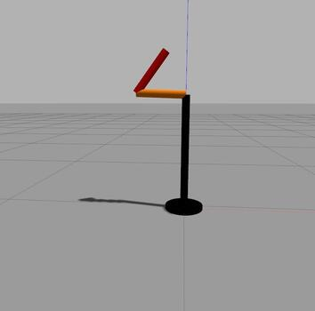

# Planar Robot Tutorial

This is a tutorial on how to model and simulate a simple 2 DOF planar robot in Gazebo simulator.




# Setup

This repository has been tested in Ubuntu 18.04 and ROS Melodic only. To set up your PC with required software requirements, please following the "Setup your PC" section. If already set up PC, move over to "Setup ROS workspace".

### Setup your PC

* Install [Ubuntu Bionic 18.04](https://releases.ubuntu.com/bionic/) on your PC by following this [guide](https://ubuntu.com/tutorials/install-ubuntu-desktop#1-overview)
* Install ROS Melodic by following this [guide](http://wiki.ros.org/melodic/Installation/Ubuntu)


### Setup ROS workspace
```
mkdir -p ~/catkin_ws/src
cd ~/catkin_ws/src
catkin_init_workspace
```

### Clone the repository
```
cd ~/catkin_ws/src
git clone https://github.com/kenembanisi/planar_robot_tutorial.git
```

### Install dependencies
```
cd ~/catkin_ws
sudo apt update
rosdep install --from-paths ./src --ignore-src -y
```

### Compile
```
cd ~/catkin_ws
catkin_make
```

## Run
### Draw Circle
Run the following command in one Terminal
```
source ~/catkin_ws/devel/setup.bash
roslaunch planar_robot_tutorial planar_robot_tutorial.launch
```


And Run the following command in another terminal
```
source ~/catkin_ws/devel/setup.bash
rosservice call /gazebo/unpause_physics "{}"
rosrun planar_robot_tutorial draw_circle.py
```

### Make Plot of Results
Run the following command in one Terminal
```
cd ~/catkin_ws/src/planar_robot_tutorial/src
python bag_to_csv.py; python data_parser.py
```
